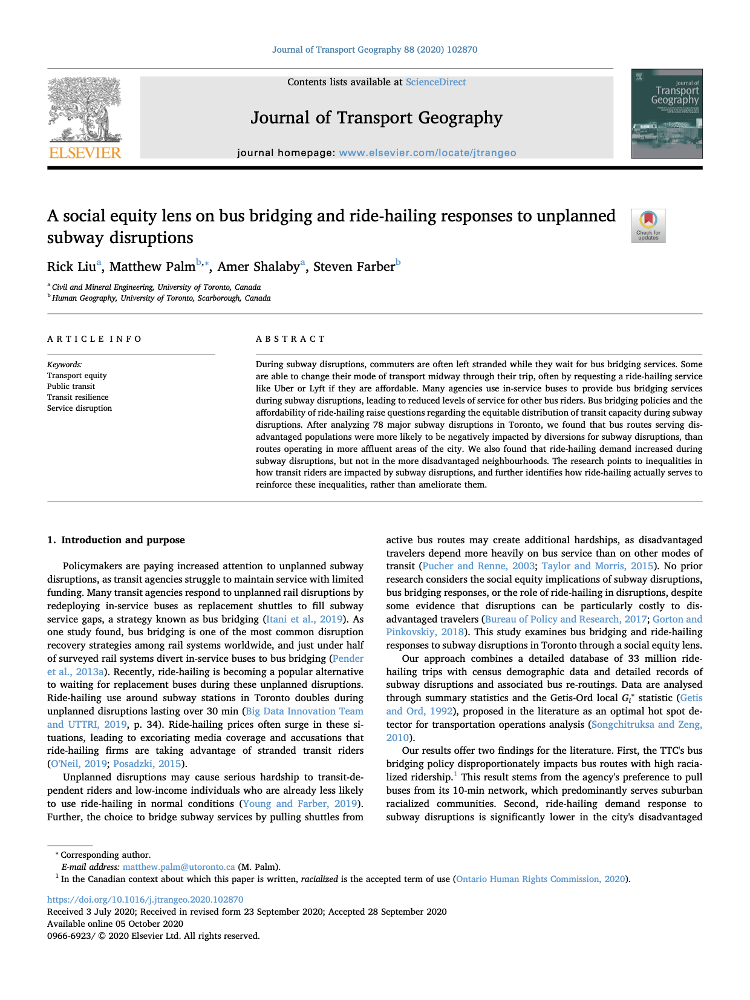

Below are some recent documents where I am the sole author, or am the primary author of. test 6

|PDF for Download &nbsp; &nbsp; &nbsp; &nbsp; &nbsp; &nbsp; &nbsp; &nbsp; &nbsp; &nbsp; &nbsp;&nbsp; &nbsp; &nbsp; &nbsp; &nbsp; &nbsp;&nbsp; &nbsp; &nbsp; &nbsp; &nbsp; &nbsp; &nbsp; &nbsp; &nbsp; &nbsp; &nbsp;&nbsp; &nbsp; &nbsp; &nbsp; &nbsp; &nbsp;&nbsp; &nbsp; &nbsp; &nbsp; &nbsp; &nbsp; &nbsp; &nbsp; &nbsp; &nbsp; &nbsp;&nbsp; &nbsp; &nbsp; &nbsp; &nbsp; &nbsp; &nbsp; &nbsp; &nbsp;&nbsp; &nbsp; &nbsp; &nbsp; &nbsp; &nbsp;&nbsp; &nbsp; &nbsp; &nbsp; &nbsp; &nbsp; &nbsp; &nbsp; &nbsp; &nbsp; &nbsp;&nbsp; &nbsp; &nbsp; &nbsp; &nbsp; &nbsp; |Summary|
|-------|-------|
||I worked on this conference paper for the 2022 TRB Conference from May to July 2022. The content in it will eventually form ~20% of my thesis. Here, I find that equity-seeking groups rely on different routes/stations than the general populations, which could have implications for how we can equitably invest in the TTC.|
||Over July and August of 2022, our team of 3 participated and won the University of Toronto Transportation Alumni Network Competition. The theme was to address equity challenges in the post-pandemic world, which led our team to recommend changes to the fare structure of GTHA transit. We found that eliminating the double fare will improve the access to opportunity of equity-seeking groups more than the general population, and proposed a policy that could be implemented quickly.|
||As part of a group of 4, I lead our team in proposing a new LRT line on Jane Street for our capstone project. We modeled our project as close to the TPAP as possible. We demonstrated the rationale for the project, proposed various alternatives scenario, and developed preliminary designs of the corridor and stations.|
||Initially a 4 month undergraduate thesis, this effort led to a submission in the 2021 TRB conference, the TransitData 2020 Conference, and a journal article in the Journal of Transportation Geography. I looked at the responses to subway disruptions from the TTC, and from individuals using ridesharing services, and found equity-seeking neighbourhoods were negatively impacted by the TTC, and had less availability of ridesharing services than the general population.|
||Arguably my pride and join of my undergraduate, this report was the UofT Concrete Canoe Team's submission to the 2019 Canadian National Concrete Canoe Competition. For 2018-2019, I was captain of the team, and led a team of 25 to build and race a canoe made out of concrete. Along with racing and displaying the canoe, we also were judged based on this report and a presentation. I stepped down after that year, but continue to find ways to not only help the UofT team, but also the wider community.|

